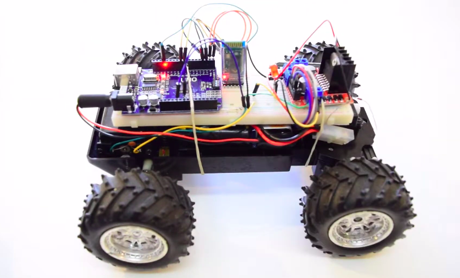
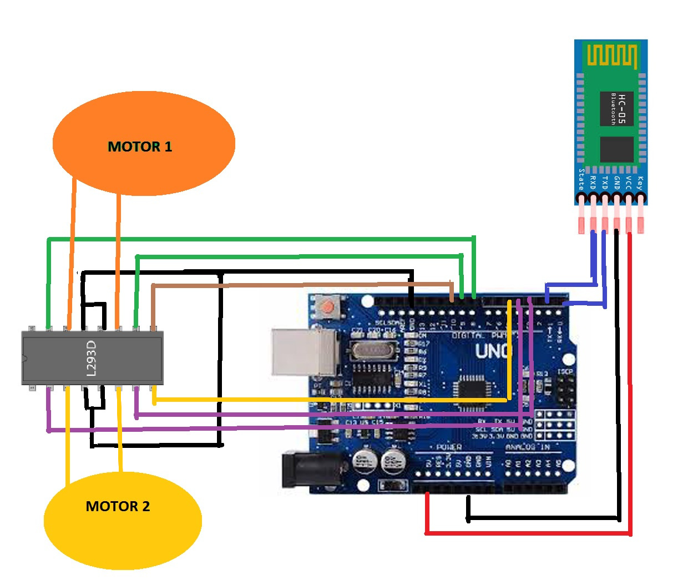

# RemoteCar

Carrinho de controle remoto controlado pelo celular, usando Arduíno Uno e um carrinho antigo.



## Materiais

* Carrinho de controle remoto convencional.
* Arduíno Uno.
* Módulo Bluetooth HC-05 ou HC-06.
* Ponte H.
* Smartphone Android.

## Montagem

Seguir a montagem abaixo:



# Softwares

### Pré requisitos

* [Arduino IDE](https://www.arduino.cc/en/main/software)
* [Git](https://git-scm.com/downloads)*

Clonar o repositório:
```
git clone https://github.com/MatheusBurda/Pong.git
```
*Ou baixe o código no botão verde no topo da página e extraia os arquivos.

## Arduino

* Na pasta do projeto abra a pasta "arduino" e abra o arquivo "carro_main.ino".
* Conecte o Arduino no computador.
* Vá em Tools -> Boards -> Arduino Uno.
* Vá em Tools -> Port -> Selecione a porta do Arduino disponível.
* Pressione 'Upload' e o código será carregado para a placa.

## APP

* Transfira o arquivo 'controle remoto.apk' para seu celular e instale.
* Após estar ligado o carrinho conecte o bluetooth com a placa bluetooth.
* Abra o controle manual e é só dirigir o carrinho.

# Autor

* **[Matheus Burda](https://github.com/MatheusBurda)** - *Começo ao fim* 

## Licença

This project is licensed under the MIT License - see the [LICENSE.md](LICENSE.md) file for details.
